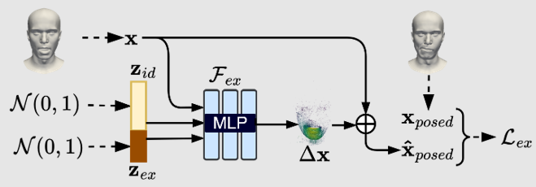

# Learning Neural Parametric Head Models using 2D Adversarial Objectives
## Abstract
In this thesis, we propose to learn a neural parametric head model which utilizes 2D adversarial objective on multi-view differentiable renderings of 2D normal maps along side existing 3D point-cloud based objectives to properly constrain the latent spaces, thus enabling it to fit noisy point-clouds of real face scans. Additionally, we use tri-plane based hybrid neural surface representation to leverage its 3D aware rich features for representing high-frequency details and faster convergence. We empirically show that the proposed model not only out performs most of the existing models in reconstruction and fitting, but also is more robust to scanning noise. To our knowledge, we are the first to use tri-plane based hybrid surface representation in the context of neural parametric head models.

 - **Project Page:** https://tatban.github.io/aphm_project_page/
 - **Thesis PDF:** https://tatban.github.io/aphm_project_page/Bandyopadhyay_MA_Thesis_Final.pdf
 - **Slides:** https://tatban.github.io/aphm_project_page/MA_Presentation_final_Tathagata.pdf

***Due to complexity of the training procedure and multiple dependencies on several repositories, the training files are skipped for now. Soon, the simplified refactored training files will be provided. Sorry for the inconvenience at the moment.***

